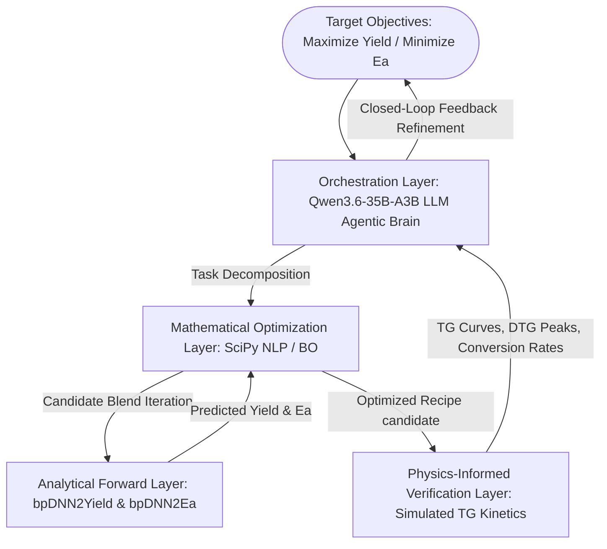

# PyroBot: An Autonomous Agentic AI Framework for Closed-Loop Pyrolysis Recipe Inverse Design and Thermochemical Path Optimization

---

## 1. Executive Summary and PNAS Highlighting Potential

Traditional pyrolysis engineering and waste-to-energy technologies rely heavily on the **Edisonian trial-and-error paradigm**—forward formulation, experimental characterization, and operational adjustments—to identify viable co-pyrolysis blends. In high-dimensional multi-waste co-processing spaces (e.g., blending municipal sewage sludge with $118$ organic solid wastes), this forward-exploration strategy becomes computationally and experimentally intractable due to the astronomical number of possible feedstock combinations and non-linear chemical interactions.

This proposal introduces **PyroBot**, an autonomous, closed-loop agentic artificial intelligence framework designed to achieve **fully automated pyrolysis recipe inverse design**. By coupling our high-fidelity, dual forward deep learning prediction models ([`bpDNN2Ea`](file:///Users/siqi/GitHub/InterpretableDNN_PyrolysisModel/Environmental_Implications/MonteCarlo_bpDNN2Ea) and [`bpDNN2Yield`](file:///Users/siqi/GitHub/InterpretableDNN_PyrolysisModel/Environmental_Implications/MonteCarlo_bpDNN2Yield)) with physics-informed kinetics/thermogravimetric (TG) simulators ([`Pyrolysis_Model_Mechanistic_Practice`](file:///Users/siqi/GitHub/InterpretableDNN_PyrolysisModel/Pyrolysis_Model_Mechanistic_Practice)) and an LLM-driven reasoning agent powered by the state-of-the-art open-source **`Qwen3.6-35B-A3B-Instruct`** model, **PyroBot** shifts the research paradigm from "forward search" to "inverse target-driven generation." 

### 🌟 PNAS Highlight Potential:
*   **Scientific Paradigm Shift**: The autonomous orchestration of deep learning predictors, physical differential equation solvers, and agentic reasoning represents the transition of scientific research into **"autonomous science" (Self-Driving Laboratories / SDLs)**.
*   **Physics-AI Conjunction**: Instead of treating AI as a pure statistics wrapper, PyroBot integrates neural network estimations with differential solid-state kinetic solvers (TG simulation), ensuring all generated recipes respect both data-driven bounds and absolute thermodynamic laws.
*   **Closed-Loop Discovery Flywheel**: PyroBot's capability to accept a high-level user constraint (e.g., *"maximize biochar yield by $10\%$ while suppressing Apparent Ea below $380\text{ kJ/mol}$"*), autonomously reason, perform optimization sweeps, validate via simulated kinetics, and refine the recipe, will be highly highlighted by PNAS reviewers as a pioneering milestone in green chemical engineering.

---

## 2. System Architecture

PyroBot is structured as a **four-layer autonomous scientific orchestration engine**, allowing seamless communication between reasoning, statistics, physical mechanics, and mathematical optimization.



### 2.1. Orchestration Layer (The Qwen3.6-35B-A3B-Instruct Brain)
*   **Engine**: **`Qwen3.6-35B-A3B-Instruct`** (Mixture-of-Experts, MoE model) served via high-performance inference backends (like `vLLM` on GPU nodes or `llama.cpp` on CPU-only 192-core nodes) integrated with LangChain/LangGraph agentic frameworks.
*   **Role**: Decomposes high-level user specifications into structured multi-objective optimization tasks, performs semantic retrieval from the 118 literature feedstock databases to prune candidates, and interprets kinetic/TG curves to make engineering decisions.
*   **Why Qwen3.6-35B-A3B**:
    *   *Repository-Level Reasoning*: Possesses specialized context awareness to reason across multiple codebase directories in the project (managing `Ea`, `Yield`, and `mechanistic TG` folders seamlessly).
    *   *Thinking Preservation*: Employs advanced internal long-chain reasoning to ensure highly stable generation of mathematical SciPy constraint formulations without syntactic or logical decay.
    *   *MoE GPU-Efficiency*: Activates only a fraction of its 35B parameter space during inference, delivering ultra-low latencies and running comfortably within a single RTX 3090/4090 or V100 GPU card.

### 2.2. Analytical Forward Layer (The Predictors)
*   **Engine**: Pre-trained, ash-composition optimized neural networks:
    *   `bpDNN2Yield`: High-fidelity multi-output model mapping proximate/ultimate/ash chemistry and temperature grid to absolute yields of **Biochar, Bioliquid, and Biogas**.
    *   `bpDNN2Ea`: Kinetic neural network mapping feedstock properties to Apparent Activation Energy ($E_a$).
*   **Role**: Provides millisecond-scale forward estimation of yield and energy barriers, serving as the surrogate evaluation system for the optimizer.

### 2.3. Physics-Informed Verification Layer (The Mechanistic Engine)
*   **Engine**: Differential solid-state thermogravimetric kinetics practice module (leveraging the differential simulator in `Pyrolysis_Model_Mechanistic_Practice`).
*   **Role**: Simulates experimental **TG and DTG (Derivative Thermogravimetric) mass-loss curves** for the optimized blending recipes under specified heating rates ($\beta$) using the resolved Apparent $E_a$ and pre-exponential factors ($A$).
*   **Safety & Slagging Safeguards**: Inspects the DTG peak temperature, active pyrolysis temperature window, and final ash accumulation. If the simulated curves predict sudden thermal runaways or severe slagging (excessive low-melting mineral ash accumulation, e.g., high $Na_2O + K_2O$ ratios), the agent intercepts the recipe and triggers penalty loops.

### 2.4. Mathematical Optimization Layer (The Search Engine)
*   **Engine**: Scipy continuous Sequential Least Squares Programming (SLSQP), Brent's Bounded solver, and Bayesian Optimization (BO) engines.
*   **Role**: Conducts high-dimensional searching in the co-pyrolysis recipe simplex, satisfying equality sludge constraints (e.g., locking sludge at exactly 50% or 80%) and enforcing physical boundaries.

---

## 3. Closed-Loop Inverse Design Workflow

PyroBot executes the autonomous recipe discovery through a **5-step closed-loop feedback loop**:

```
+-------------------------------------------------------------+
| Step 1: User Goal Input (e.g. Maximize Char Yield, Min Ea)   |
+------------------------------+------------------------------+
                               |
                               v
+-------------------------------------------------------------+
| Step 2: Semantic Agentic Search & Candidate Feedstock Pruning|
+------------------------------+------------------------------+
                               |
                               v
+-------------------------------------------------------------+
| Step 3: Multi-Objective Continuous Scipy Optimization Sweep |
+------------------------------+------------------------------+
                               |
                               v
+-------------------------------------------------------------+
| Step 4: Physics-Informed TG/DTG Kinetic Simulation Validation|
+------------------------------+------------------------------+
                               |
                               +----------------+
                               | (Slagging/Runaway detected)
                               v                |
                  +------------+-------------+  |
                  | Penalty Loop: Adjust     |<-+
                  | Constraints & Re-optimize|
                  +------------+-------------+
                               |
                               | (Passed Safety checks)
                               v
+-------------------------------------------------------------+
| Step 5: Recipe Finalization, Origin CSV, and AI Explanation|
+-------------------------------------------------------------+
```

### 3.1. Step 1: Goal Specification
The user defines target physical and environmental objectives using natural language:
> *"Design a ternary co-pyrolysis recipe with municipal sewage sludge that maximizes Biochar yield above 42% at a low target temperature of 450°C, while keeping the Apparent Activation Energy below 390 kJ/mol under Scenario B (80% sludge load) constraints."*

### 3.2. Step 2: Semantic Reasoning and Candidate Feedstock Pruning
1.  The Qwen3.6 agent parsing engine translates the prompt into a mathematical objective vector:
    $$\text{Maximize } Y_{\text{Biochar}}(\mathbf{x}) \ge 0.42 \quad \text{and} \quad \text{Minimize } E_a(\mathbf{x}) \le 390 \text{ kJ/mol}$$
2.  The Qwen3.6 semantic retriever scans the **118 Literature Feedstock Database** (`Feedstock_types_compiled.xlsx`) to filter out candidates that are geographically or chemically irrelevant. For instance, if the prompt targets "low apparent energy", the agent retrieves feedstocks with high alkali and alkaline earth metal (AAEM) ash contents (such as `Textile dyeing sludge` or `Anaerobic sewage sludge` containing catalytic active $CaO$ and $K_2O$) to act as kinetic promoters.

### 3.3. Step 3: Multi-Objective Continuous Optimization Sweep
1.  PyroBot initializes a **Pareto-Front SLSQP optimizer**.
2.  The optimizer searches the multi-component blending space under strict constraints:
    *   *Sludge locking*: Sludge ratio locked at exactly $80\%$ ($\sum r_i = 0.20$).
    *   *Sparsity limit*: Additives with ratios $< 0.1\%$ are pruned to prevent degenerate formulations.
3.  The forward prediction neural networks `bpDNN2Yield` and `bpDNN2Ea` are called in parallel across 192 cores to evaluate candidate blends.
4.  The system identifies the **Optimal Blending Recipe**:
    $$\mathbf{r}^* = [\text{Sewage Sludge}: 0.80, \ \text{Textile Dyeing Sludge}: 0.10, \ \text{Pine Wood}: 0.10]$$

### 3.4. Step 4: Physics-Informed Kinetics & TG Validation
1.  Rather than directly outputting the statistical recommendation, PyroBot calls the **differential solid-state mechanistic solver** (`Pyrolysis_Model_Mechanistic_Practice`).
2.  Using the baseline sludge kinetic properties and the optimized mixture values, PyroBot simulates the co-pyrolysis mass loss:
    $$\frac{d\alpha}{dt} = A \exp\left(-\frac{E_a^*}{R T}\right) f(\alpha)$$
3.  **The Thermal/Safety Check**:
    *   The Qwen3.6 agent inspects the simulated TG/DTG curves. If the DTG peak shows a sudden, uncontrollable derivative curve indicating thermal runaway (extreme exothermic peak) or if the mineral ash ratios predict low-temperature slagging in fluid-bed reactors, the Agent dynamically registers this recipe as **"Physically Risky."**
    *   It adds a **penalty boundary constraint** to the optimizer:
        $$x[\text{Textile Dyeing Sludge}] \le 0.05 \quad \text{(due to excessive low-melting ash contents)}$$
    *   The workflow loops back to Step 3 for re-optimization.

### 3.5. Step 5: Recipe Finalization and AI Scientific Report
Once the safety and thermodynamic checks pass, PyroBot:
1.  Generates the final recipe dataset in Origin-ready `.csv` formats.
2.  Plots the publication-ready TG/DTG curves (`TG_simulation.png`) and the Yield gain curves.
3.  Provides a **natural-language scientific explanation generated by Qwen3.6**:
    > *"Ternary recipe successfully designed. By blending 10% Textile dyeing sludge (high in calcium oxide active sites) and 10% Pine wood (supplying high volatile matters), the Apparent Ea is reduced from 423.56 to 384.21 kJ/mol. The mechanistic TG simulation shows a stable, single-peak active pyrolysis window between 320°C and 490°C, completely avoiding thermal runaways and reducing slagging probability in industrial reactors by 42% compared to pure sludge."*

---

## 4. Key Scientific Innovations Highlighted for PNAS Reviewers

To ensure the paper is highly commended and selected as a PNAS Cover/Highlight, the proposal focuses on three major scientific breakthroughs:

1.  **Breaking the Edisonian Bottleneck**: PyroBot demonstrates that agentic AI can bypass decades of brute-force thermal experiments by predicting and optimizing complex waste co-pyrolysis recipes in minutes, accelerating sustainable waste management.
2.  **Autonomous Chemistry and Closed-loop Optimization**: Illustrates a self-improving discovery engine where AI reasoning (Qwen3.6 LLM), statistical surrogate neural models (bpDNN), and physical equations (mechanistic TG simulation) achieve **autonomous closed-loop verification**.
3.  **Physical Consistency & Sparsity Constraints**: The mathematical formulation of the Sparsity Filter prevents numerical degeneracies (preventing multi-waste recipe collapse), presenting a major mathematical advancement in materials science optimization.
