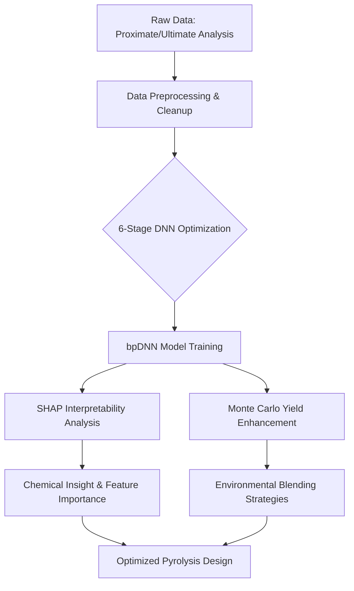

# Interpretable Deep Learning Pyrolysis Model Framework

Advanced Artificial Intelligence modeling of the biomass pyrolysis process to precisely leverage renewable bioenergy feedstocks globally.

## Project Overview

This research repository establishes an advanced, interpretable deep learning framework for understanding and predicting the complex phenomena involved in biomass pyrolysis. By combining backpropagation deep neural networks (bpDNN) with SHAP (SHapley Additive exPlanations) analysis, this project provides both high-accuracy predictions and transparent insights into the underlying chemical and physical drivers.

The framework focuses on two critical aspects of pyrolysis:

- **Product Yields**: Bio-oil, bio-char, and bio-gas distribution.
- **Kinetics**: Prediction of activation energy (Ea) and validation through thermogravimetric analysis.

---

## Core Research Axes

### 1. Pyrolytic Products Yield (`bpDNN4PyroProd_src`)

Integrated modeling of bioenergy yields using biomass proximate and ultimate analysis paired with process temperature. This module features a comprehensive SHAP interpretability pipeline that bridges the gap between "Black Box" DNNs and chemical intuition.

- **Goal**: Maximize bio-oil/biogas recovery through optimized feedstock blending.
- **Key Feature**: Interpretable feature importance ranking for multi-component biomass mixtures.
- [View Documentation](bpDNN4PyroProd_src/README.md)

### 2. Reaction Barrier / Activation Energy (`bpDNN4Ea_src`)

Precise prediction of the activation energy (Ea) required for various feedstock degradation stages. This module integrates modern neural networks with classical kinetic validation.

- **Goal**: Facilitate process design and energy efficiency calculations for large-scale pyrolysis.
- **Key Feature**: Automated validation of predicted kinetic parameters against experimental TG/DTG data.
- [View Documentation](bpDNN4Ea_src/README.md)

---

## Model Optimization Framework

The high accuracy of the models is achieved through a rigorous 6-stage systematic hyperparameter optimization process (found in `DNN_Optimization-*/`):

1. **HL Optimization**: Exploration of hidden layer architectures (depth and neurons).
2. **Learning Rate**: Precision tuning of lr, lr_inc, and lr_dec for convergence stability.
3. **Database Division**: Evaluation of Training-Testing (TT) vs. Training-Validation-Testing (TVT) strategies.
4. **Momentum Selection**: Optimizing the momentum coefficient to avoid local minima.
5. **Activation Functions**: Comparative study of logsig, tansig, and radbas transfer functions.
6. **Training Strategies**: Analysis of convergence criteria and adaptive training mechanisms.

---

## Environmental & Scientific Implications

The framework is actively applied to address global environmental challenges, specifically the transformation of waste streams into energy.

### Case Study: Municipal & Sewage Sludge

Detailed analysis of blending municipal sludge with traditional biomass (e.g., rice husk, sawdust) to reduce activation energy and enhance bio-char quality.

- **Datasets Used**: `Municipal_Sludge_Data.xlsx`, `US_SewageSludge.xlsx`.
- **Methodology**: Monte Carlo simulations are integrated with the DNN models to explore thousands of blending ratios, identifying optimal strategies for pollution mitigation and energy recovery.
- **Data Engineering**: Specialized scripts (`missing_value_handler.py`) perform data cleaning and imputation for heterogeneous sludge datasets.

---

## Workflow Diagram



---

## Repository Structure

```
.
├── bpDNN4PyroProd_src/         # Source code: Pyrolytic products yield prediction
├── bpDNN4Ea_src/               # Source code: Activation energy (Ea) prediction
├── Environmental_Implications/ # Research on feedstock blending & sludge datasets
├── DNN_Optimization-*/         # Extensive datasets & hyperparameter tuning logs
├── Reference_Collections/      # Supporting research materials and literature
└── LICENSE                     # Project license
```

---

*This repository represents a state-of-the-art approach to renewable energy optimization through interpretable computational intelligence.*
